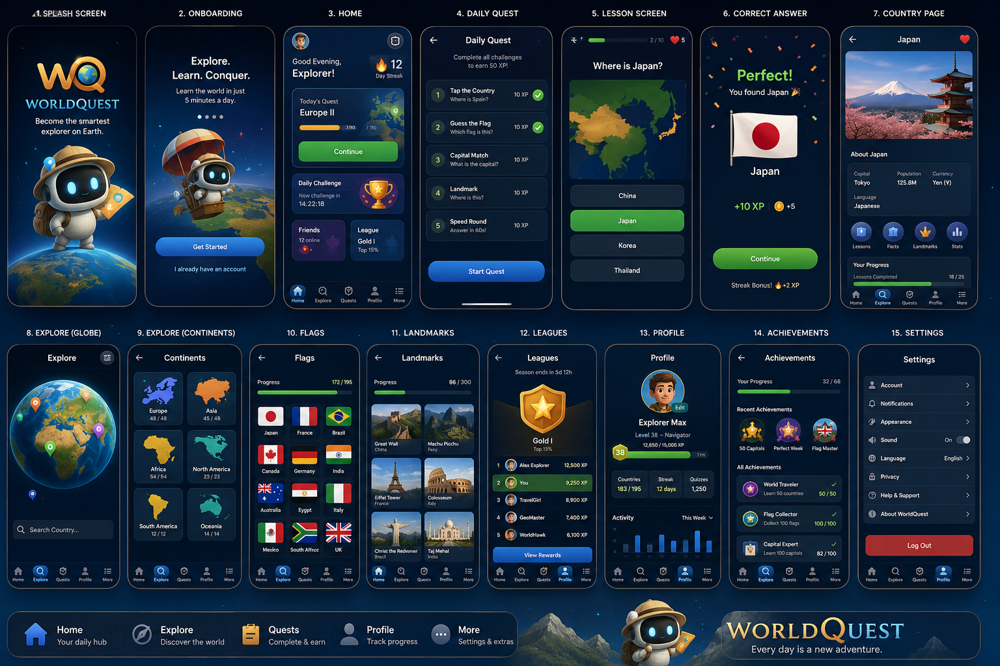

<div align="center">

# 🌍 WorldQuest

**Learn the world in five minutes a day.**

Become the smartest explorer on Earth — countries, flags, capitals and landmarks,
taught by a spaced-repetition engine and wrapped in a game worth returning to.

</div>

---

## Status

**Phase 0 → Phase 1.** Foundations are written; the walking skeleton is next.
There is no shippable app yet — and that is deliberate. See
[`docs/plan/build-order.md`](docs/plan/build-order.md).

## What it is

A mobile learning app (iOS + Android) that teaches visual world knowledge in short
daily sessions, with XP, coins, streaks, hearts, leagues, collections and
achievements — designed for a 10-year-old and a 40-year-old to both enjoy.

Under the hood it is **a learning engine for any visual knowledge**. Geography is
content pack #1. History, wildlife, art and astronomy are supposed to be a JSON file,
not a rewrite. That constraint shapes the whole codebase.

<div align="center">



*v1.0 target — 15 screens*

</div>

## Start here

| | |
|---|---|
| 📜 **[PROJECT.md](PROJECT.md)** | The constitution — stack, structure, standards, schema, DoD |
| 🤖 **[CLAUDE.md](CLAUDE.md)** | How AI agents work in this repo |
| 📚 **[docs/](docs/README.md)** | Product bible, personas, design system, engine specs |
| 🗺️ **[docs/plan/build-order.md](docs/plan/build-order.md)** | What we build, in what order, and why |
| ✅ **[docs/plan/phase-0-checklist.md](docs/plan/phase-0-checklist.md)** | Where Phase 0 stands |

## Repo map

```
PROJECT.md      the constitution — read first
CLAUDE.md       AI agent operating manual
apps/mobile     Expo app (screens + navigation only)
packages/
  engines       ★ pure TypeScript domain logic — the platform
  content       data-as-content packs, schemas, validators
  design        design tokens + UI primitives
  i18n          locale files + typed keys
  analytics     typed event registry
  api           generated Supabase types + client
supabase/       migrations, edge functions, seed
docs/           product · design · systems · engineering · adr · plan
.claude/        agents · skills · commands · settings
```

## Tech stack (short version)

TypeScript · Expo / React Native · expo-router · Zustand + TanStack Query ·
Supabase (Postgres, Auth, RLS, Edge Functions) · FSRS spaced repetition ·
Reanimated 3 · i18next · PostHog · RevenueCat.
Full rationale and alternatives: [`PROJECT.md §2`](PROJECT.md#2-tech-stack) and
[`docs/adr/`](docs/adr/).

## Principles worth stating up front

1. **Content is data.** Never hardcode a fact or a question.
2. **Copy is a key.** Never hardcode a string — sv and en from day one.
3. **Tokens or nothing.** Never hardcode a colour or a spacing value.
4. **The server decides rewards.** The client only renders them.
5. **Kind gamification.** Momentum, never manipulation.
6. **Accessible from commit one.** Retrofitting a11y is a rewrite.

## Development (once Phase 1 lands)

```bash
pnpm install          # from the repo root, always
pnpm db:start         # local Supabase
pnpm dev              # Expo dev server
pnpm test             # engines + app
pnpm verify           # typecheck · lint · test · content · i18n · a11y
```

## Contributing

Read [`PROJECT.md §11`](PROJECT.md#11-git-workflow) and
[`§12`](PROJECT.md#12-definition-of-done). Every PR names the persona it serves and
ticks the Definition of Done.

## Licence

Not yet chosen — content licensing (flags, imagery, map data) is tracked in
[`docs/engineering/security-privacy.md`](docs/engineering/security-privacy.md#content-licensing).
