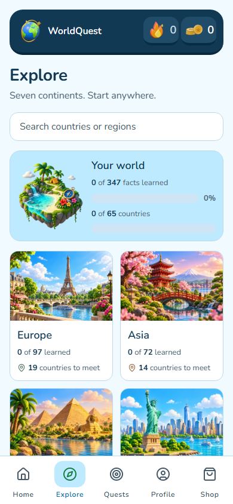
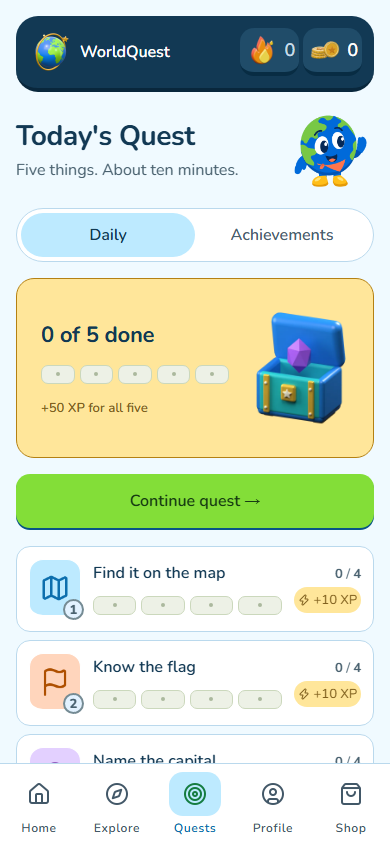
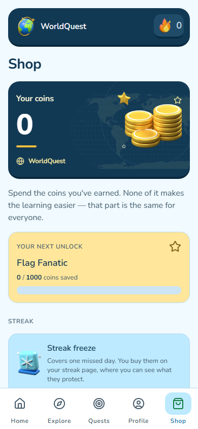

# Expedition art set ? September 28, 2026

Eight new decorative assets, integrated into the existing app. The approved globe
mascot remains unchanged. No factual geography, flags, prices or reward rules changed.

| Asset | Production use | Source |
|---|---|---|
| Treasure chest | Quest summary, streak opening, empty collections | Original Blender geometry; hinged opening and gem-rise tracks |
| Amethyst gem | Streak collectible and gem stat | Original Blender geometry; lift/settle track |
| Coin stack | Shop wallet and coin stats | Original Blender geometry |
| Passport | Explore flag collection shortcut | Original Blender geometry |
| Compass | Explore country collection shortcut | Original Blender geometry |
| Trophy | Achievement overview | Original Blender geometry |
| Freeze token | Existing streak-freeze item | Original Blender geometry |
| Discovery island | Explore progress illustration | Built-in ImageGen raster; imaginary decorative geography |

## Sources and provenance

`models/` contains seven editable `.blend` masters and seven embedded `.glb` models.
All meshes and materials were authored locally in `scripts/build-expedition-assets.py`,
using the existing daylight builder's helpers. No downloaded mesh, texture, third-party
character, paid provider, or new asset license was introduced. Repository licensing
applies to procedural source. The optional game-dev CLI was not installed; local
Blender 5.2 and the repository's static GLB validation were used instead. This is not
a game-dev canonical-package certification.

`masters/` retains individual transparent 640px renders and 40 chest-film frames.
The film uses the exact chest model. Its native runtime uses the existing 8x5,
240px-per-frame, 20fps contract. GLB tracks are sampled at 24fps; the deliberately
slower app film lasts 1.95 seconds. Runtime assets are optimized WebP derivatives,
not live 3D. No runtime 3D engine or dependency was added. Historical art is retained.

ImageGen master: `masters/discovery-island.png` (1254x1254 RGBA), generated with the
host tool. Original: `exec-191976ed-615c-49fc-a34b-db45b6d887c8.png`. This is a raster
illustration, not a recovered or generated 3D model. Prompt is in `island-prompt.txt`.

The transparent island includes faint near-zero-alpha fringe at the canvas edge.
Visible-silhouette padding is checked at alpha >8, consistently with the existing
asset pipeline. No opaque backdrop is baked into any asset.

## Reproduce

- Blender background: `--python scripts/build-expedition-assets.py`.
- `node scripts/build-expedition-art.cjs` derives runtime art and typed manifest.
- `node scripts/validate-expedition-models.cjs` validates GLB structure, embedded
  geometry, triangle/size budgets and expected animation tracks; writes hashes.

## Verification

- Seven GLBs pass static validation: 1,740?18,860 triangles and under 400KB each.
- Eight masters pass transparency and visible-silhouette padding checks.
- Runtime family including the chest film is approximately 400KB.
- 164 affected component/streak/shop/achievement tests pass; mobile TypeScript passes.
- Additional quest regressions: 35 passed after removing the obsolete chest scrim.
- Four-route real Expo screenshots at 320x568, 390x844, 430x932 and 768x1024;
  Quest rechecked after its layout correction. Dark/Swedish/150%-text/reduced-motion
  captures cover Explore, Shop and Quests at all four sizes.
- iOS/Android asset-integration bundles pass: 4.54MB JS and 9.30MB external assets
  on each platform. Subsequent changes are the quest row and trophy header layout;
  their web exports and TypeScript were checked. Native bundling is not device QA.
- Full repository verify/E2E was not rerun for this asset increment.
- Physical-device performance and native GPU import of GLBs are not verified. The
  production app uses raster derivatives, not those GLBs.

## Actual app captures

| Explore | Quests | Shop |
|---|---|---|
|  |  |  |

The screenshots are from the real Expo web app, not the generated island artwork.
No balance, progress, claim or purchase fixture was added to production code.
