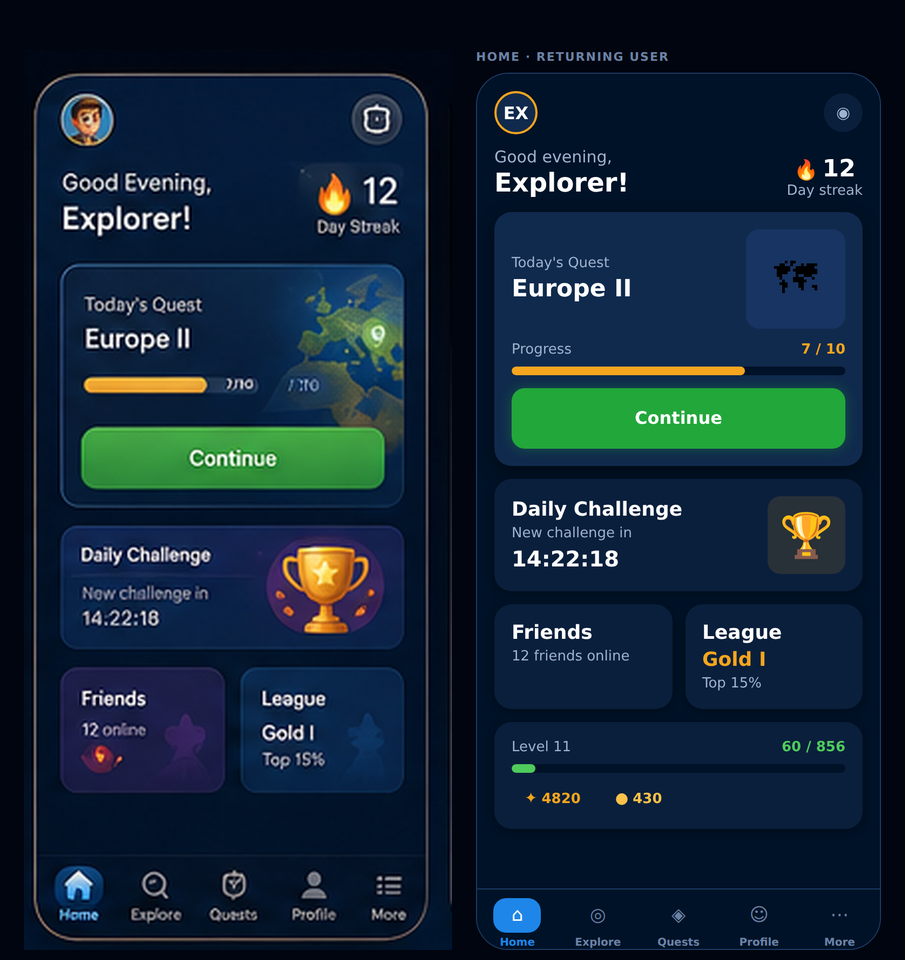
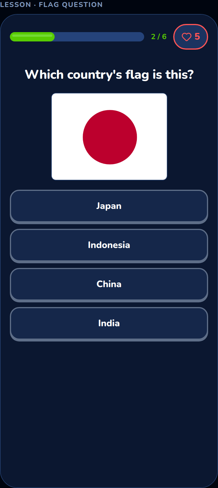
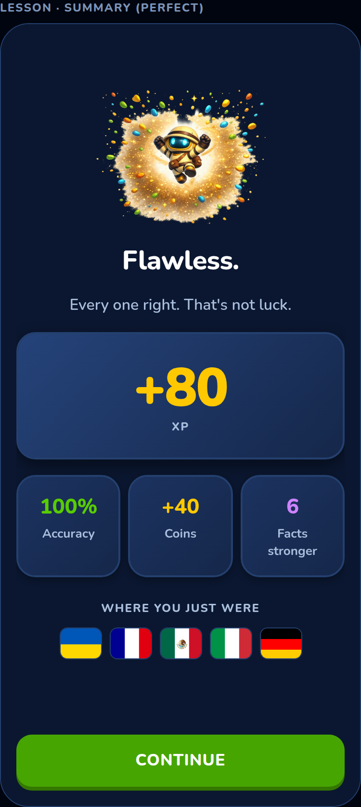
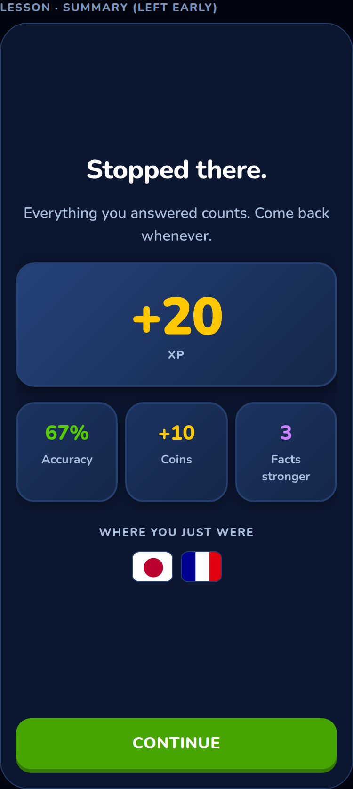

# Mockup fidelity

How close the built app is to [`assets/mockup-v1.png`](assets/mockup-v1.png), what
still separates them, and which differences are **deliberate**.

Regenerate the comparison with `pnpm screenshot`.

---

## The three categories

Every difference between the mockup and the app falls into one of these. The
distinction matters, because only the first is a to-do list.

### 1. Buildable now — closed

Structure, hierarchy, colour and layout. All of it comes from tokens, so it was a
day's work once the components existed:

- Avatar with its ring, and the inbox button
- Two-tier greeting (light salutation, bold role) with the streak stacked right
- Quest card with the art bleeding to the card edge
- **Amber** quest progress — the mockup uses gold here, not the green used for
  completion elsewhere, and it means something different (a reward track), so it is
  a `reward` tone on `ProgressBar` rather than a colour override
- Daily Challenge card with countdown in tabular numerals
- Friends / League tile pair
- Five-tab bar with the active tab's filled chip
- **Numbered steps on the daily quest** (mockup screen 4). The five rows had titles,
  bars and XP but no numbering and no completion mark, so they read as five unrelated
  meters rather than one quest with five steps. A done step is now a filled tick, not
  only a full bar — at a glance 100 % and 95 % are the same picture, and a tick is not.
  The circle is `aria-hidden`: the row already announces its title and progress, and a
  reader saying "3" before every task is noise.
- **Real flags** (mockup screens 5, 7 and 10). All 65, rasterised from `flag-icons`
  (MIT) by `pnpm build:flags`. This closes the largest single visual gap in the app:
  the collection was 65 identical `⚑` placeholders, which is a grid of nothing.

  It also turns a **lesson question back on**. `tpl.flag-to-country.mc4` — "Which
  country's flag is this?", the mockup's own lesson screen — is modality `image`, and
  the app declared it could not draw one, so the composer filtered it out of every
  lesson ever generated. See the note below on why this was never actually blocked.

  

- **The lesson summary** (mockup screen 6). It was a heading, two chips and a button —
  the app's biggest emotional moment, rendered inert, while `gradeLesson` was already
  computing accuracy, `perfect` and `masteryChanges` and the screen threw all three
  away. It now counts the XP up from zero, varies its headline by outcome, and shows
  **facts stronger** — the one number here a quiz app could not also show.

  It also shows the flags of the countries you just answered about, which is the point
  of the change rather than a decoration: a screen made only of XP, coins and a
  percentage is a scoreboard, and this product is about the world. The artwork already
  shipped for the collection, so the row cost nothing.

  

  A lesson you walked out of gets its own treatment — no celebration, no shame, the
  same numbers, and a door. Both phases used to render identically.

  

### 2. Needs assets — blocked on a decision, not on code

The mockup's imagery is generated art. Matching it needs real assets:

| Asset | Mockup shows | Status |
|---|---|---|
| ~~Flags~~ | 65 national flags | ✅ **Done.** All 65 from `flag-icons` (MIT), 600×450 PNG, `pnpm build:flags`. Collection, country page and the lesson picture question. |
| ~~Map thumbnails~~ | Rendered Europe with a pin | ✅ **Done.** Region + country outlines projected from Natural Earth (public domain) via `world-atlas`, `pnpm build:maps`. Two tintable alpha layers sharing one projection, so the map themes from tokens. On the country page. |
| Trophy | 3D gold trophy | `ArtSlot` placeholder |
| Avatar | Illustrated character | Initials in a ringed circle |
| Atlas the mascot | Robot explorer | Not built |
| ~~Card gradients~~ | Blue→dark, purple→dark | ✅ **Done.** Semantic `gradient.*` tokens drawn by `Card`, 135° top-left to bottom-right. |
| ~~Typeface~~ | The real faces | ✅ **Bundled — now Nunito**, not the Inter + Baloo 2 pairing this row used to name. One rounded family across the whole app, per weight from `@expo-google-fonts`, splash held until they land. |
| Lesson illustration | A map of the region, filling the middle third | Artwork now exists (see the row above) at the same 4:3 box as a flag, so the prompt slot takes either. Not yet wired into the lesson composer — that needs a `map` modality in `PRESENTABLE`, which is the next step rather than a missing asset. |

Prompts for every one of these are in [`asset-prompts.md`](asset-prompts.md).

`ArtSlot` exists so this is a one-line swap per slot rather than a redesign — which is
exactly how the flags landed: `Flag` falls back to the slot when a file is missing, so
nothing had to be relaid out.

**Two rows on this table were never actually blocked, and they were the biggest two.**
Flags sat here for the whole project filed as "needs an illustrator", next to the
mascot. But [`asset-prompts.md`](asset-prompts.md) has always listed flags under **do
not generate** — *because* a hand-drawn flag with the wrong number of stars is a wrong
fact — and named `flag-icons` as the source in the same row. "Never draw this" was read
as "we cannot have this yet". They are opposite statements.

That was the second time the confusion cost this project months. The first was sound,
which sat under "assets" until someone noticed a correct-answer chime is a sine wave
rather than somebody's copyrighted work (`src/lib/sound.ts`).

**And then it happened a third time, to the map row, in the sentence that warned about
it.** The paragraph above used to end "the geometry and icon rows in `asset-prompts.md`
name sources too" — correctly identifying map geometry as the next false blocker — while
the table two sections up still filed map thumbnails as needing an illustrator. Both
were written by someone who had read the same document. Geometry now ships
(`pnpm build:maps`), from the Natural Earth source that `asset-prompts.md` and ADR 0008
had both named all along, and the content pack had been carrying an unread
`geometry: "geo/countries/SE.svg"` field on all 65 entities the whole time.

**Icons are the row this now points at.** `asset-prompts.md` names Lucide (ISC) and
Phosphor (MIT); the tab bar still draws `⌂ ◎ ◈ ☺ ⋯` as text. Check it before believing
it. The genuinely illustration-bound rows are the mascot, the avatars and the trophy: a
robot explorer is nobody's public-domain SVG.

### 3. Deliberate deviations — we are not copying these

The mockup is concept art, not a specification. Copying it exactly would ship
things our own Definition of Done forbids.

| Mockup | What we do | Why |
|---|---|---|
| Garbled text inside the progress bar | A clean `7 / 10` | It is an image-generation artifact, not a design |
| `Top 15%` and similar at ~9 px | Minimum 13 px, per the type scale | Below 13 px fails the design system and is unreadable at arm's length |
| Low-contrast grey secondary text | `text.secondary` at ≥ 4.5:1 | WCAG AA is in the DoD and is not waivable |
| Six blocks packed to the screen edge | Same six, scrolling, with breathing room | The mockup's density cannot survive 200 % text, which the DoD requires |
| `12,850 / 15,000 XP` on Profile | The real curve (`50·n^1.9`) | The mockup's numbers do not correspond to any coherent progression; see xp-economy.md |
| No wrong-answer screen | A designed one | Users see it as often as the celebration. Leaving it undesigned is how apps end up making people feel stupid. |
| Tab labels in title case at ~10 px | Title case at 11 px (`overline`, casing suppressed) | The size is on the scale; the casing follows the mockup rather than the type token, because five uppercase labels at that size read as a fence |

---

## A warning about these screenshots

Every image on this page is generated by `pnpm screenshot`, and that harness renders
the app's **real components** — with one exception, which is worth knowing about
because it already caused a false alarm.

The four lesson frames use a reconstruction of the lesson screen's presentational
layer rather than `LessonScreen` itself, which owns a state machine and cannot be
frozen mid-answer from a static render. That reconstruction drifted: it carried
`marginTop: 'auto'` on the answer options, which bottom-anchored them and opened a
half-screen void under the question. The app never did this — measured in the shipped
bundle at 390×844, the first answer sits **24 px** below the prompt — but the
screenshots said otherwise for as long as the drift existed, and a screenshot is what
people trust.

Two things now guard it. `pnpm e2e` measures the real gap and fails past 120 px, so
the app itself cannot develop that void unnoticed. And the harness fails loudly if a
font file is missing rather than silently substituting — it had been crashing since
the move to Nunito, which meant every image here was stale.

The general lesson: **a rendering of the app is not the app.** When a screenshot shows
something surprising, measure the bundle before changing the design.

## Honest status

**Structure and colour: matched.** Put the two side by side and the layout, the
hierarchy, the palette and the tab bar read the same.

**Texture: not yet.** Gradients and illustration are what make the mockup feel
premium, and both are outstanding. Expect the built app to look flatter than the
concept art until those land — that is the normal gap between a render and a
shipped screen, not a defect.

**The one thing that cannot be fixed by iterating on code** is the artwork
decision. Everything else on this page is scheduled work.
