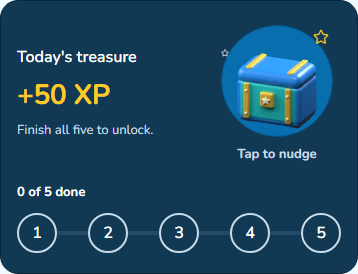

# Quest treasure card — 2 October 2026

Focused revision of the daily quest summary card, following feedback that the pale gold card and tiny progress pills looked stale.

## Result

- Navy treasure scene, larger gold XP amount and a tappable 3D chest.
- Five connected, numbered milestones correspond to the actual tasks, including completion out of order.
- The closed chest gives a bounded hop and wiggle on tap. Its existing sprite sheet opens when the quest becomes complete. Returning to an already complete quest shows the opened chest without replaying a reward.
- Reduced motion, route blur, backgrounding and unmount stop movement. Tapping the chest does not start a lesson or alter rewards/progress.
- English and Swedish copy, with the existing primary Continue action below the card.

## Screenshots

The `card-*` and `screen-*` images come from the exported app after normal onboarding. `default/` and `accessible/` contain the final route screenshot and measurement passes at 320, 390, 430 and 768 pixels wide.

- [Full quest screen](screen-default-390.png)
- [320px Swedish, dark appearance, 200% browser text](card-accessible-320.png)
- [Fresh fixture](states/fresh.png), [out-of-order completion fixture](states/partial.png), [completed fixture](states/complete.png)

The explicitly labeled `states/` screenshots render the real component with local test props. They do not represent account data. The harness stubs only device haptics, and checks live nudge and completion transitions.

## Verification

- `pnpm verify` passed, including 1,133 mobile tests in 126 files and all workspace checks.
- Mobile typecheck passed after the final implementation and test edits.
- Full browser E2E passed: 106 executed checks, one image-question check skipped because that lesson did not contain an image question. This includes a real lesson advancing quest progress, keyboard interaction and 200% text across routes.
- Quest screen suite: 19 tests, including actual milestone order, unchanged progress after chest taps, reduced-motion suppression, blur/background cancellation and listener cleanup.
- Eight final app card configurations: no text extending beyond the card, no browser errors, unchanged progress after chest interaction. See [card-review.json](card-review.json).
- Route measurements at four widths in both appearance/text configurations: no horizontal overflow, unlabeled controls or undersized targets. See [default report](default/report.json) and [accessible report](accessible/report.json).
- Gold reward text on navy passes the new contrast gate at 7.84:1.
- [Fixture interaction report](states/report.json): chest artwork decoded; nudge moves then settles; completion reveals the open chest; accessible progress values remain accurate.

Visual and interaction evidence uses React Native Web in Chromium. Native device rendering, VoiceOver/TalkBack and physical haptics were not exercised in this pass. Browser 200% text enlarges the rendered text; it is not native Dynamic Type.
